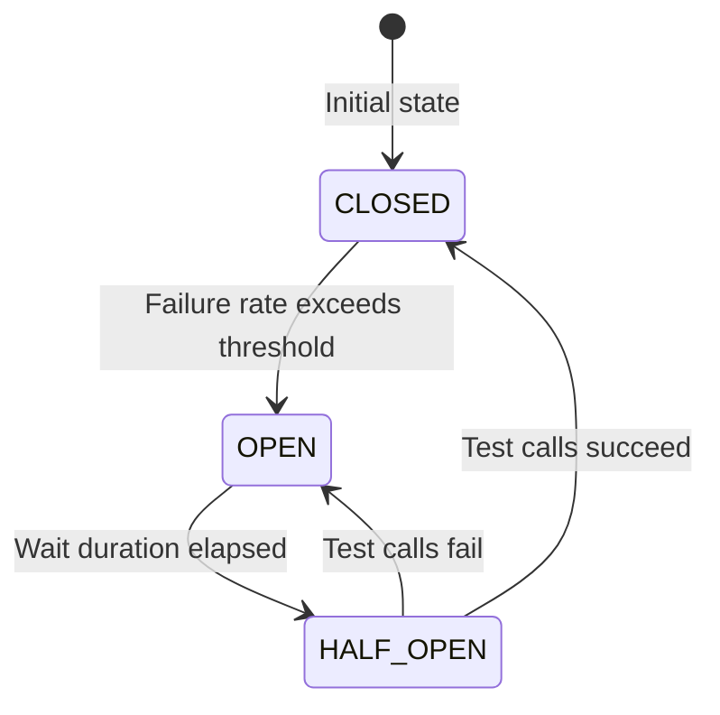
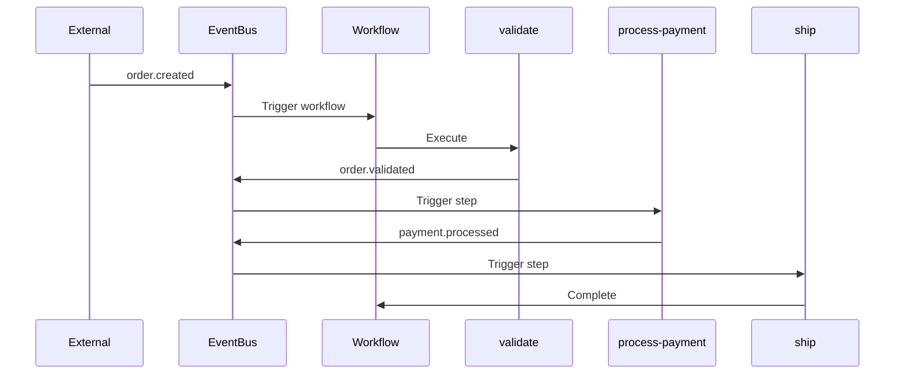

# Advanced Features

This guide covers advanced features of the Firefly Workflow Engine including Resilience4j integration, step-level choreography, parallel execution, and SpEL conditions.

## Resilience4j Integration

The workflow engine integrates with Resilience4j to provide fault tolerance patterns for step execution.

### Enabling Resilience

Resilience is enabled by default. Configure it in `application.yml`:

```yaml
firefly:
  workflow:
    resilience:
      enabled: true
      circuit-breaker:
        enabled: true
        failure-rate-threshold: 50
        slow-call-rate-threshold: 100
        slow-call-duration-threshold: PT60S
        permitted-number-of-calls-in-half-open-state: 10
        minimum-number-of-calls: 10
        sliding-window-type: COUNT_BASED
        sliding-window-size: 100
        wait-duration-in-open-state: PT60S
        automatic-transition-from-open-to-half-open-enabled: true
      rate-limiter:
        enabled: false
        limit-for-period: 50
        limit-refresh-period: PT1S
        timeout-duration: PT5S
      bulkhead:
        enabled: false
        max-concurrent-calls: 25
        max-wait-duration: PT0S
      time-limiter:
        enabled: true
        timeout-duration: PT5M
        cancel-running-future: true
```

### Circuit Breaker

The circuit breaker prevents cascading failures by stopping calls to failing steps:



**Configuration Options:**

| Property | Default | Description |
|----------|---------|-------------|
| `failure-rate-threshold` | 50 | Failure percentage to open circuit |
| `slow-call-rate-threshold` | 100 | Slow call percentage to open circuit |
| `slow-call-duration-threshold` | PT60S | Duration to consider a call slow |
| `minimum-number-of-calls` | 10 | Minimum calls before calculating rate |
| `sliding-window-size` | 100 | Number of calls in sliding window |
| `wait-duration-in-open-state` | PT60S | Time to wait before half-open |

### Rate Limiter

Controls the rate of step executions:

```yaml
firefly:
  workflow:
    resilience:
      rate-limiter:
        enabled: true
        limit-for-period: 50      # 50 calls per period
        limit-refresh-period: PT1S # Refresh every second
        timeout-duration: PT5S     # Wait up to 5s for permit
```

### Bulkhead

Limits concurrent step executions:

```yaml
firefly:
  workflow:
    resilience:
      bulkhead:
        enabled: true
        max-concurrent-calls: 25   # Max 25 concurrent executions
        max-wait-duration: PT0S    # Don't wait for permit
```

### Time Limiter

Enforces timeouts on step execution:

```yaml
firefly:
  workflow:
    resilience:
      time-limiter:
        enabled: true
        timeout-duration: PT5M     # 5 minute timeout
        cancel-running-future: true
```

### Per-Step Resilience

Resilience patterns are applied per step with unique identifiers:
- Circuit breaker name: `{workflowId}:{stepId}`
- Rate limiter name: `{workflowId}:{stepId}`
- Bulkhead name: `{workflowId}:{stepId}`

This ensures that failures in one step don't affect other steps.

## Step-Level Choreography

Step-level choreography allows steps to be triggered independently via events or API.

### Event-Driven Steps

Configure steps to listen for and emit events:

```java
@Workflow(
    id = "order-processing",
    triggerMode = TriggerMode.ASYNC,
    triggerEventType = "order.created"
)
public class OrderProcessingWorkflow {

    @WorkflowStep(
        id = "validate",
        order = 1,
        outputEventType = "order.validated"
    )
    public Mono<Map<String, Object>> validate(WorkflowContext ctx) {
        return Mono.just(Map.of("valid", true));
    }

    @WorkflowStep(
        id = "process-payment",
        order = 2,
        inputEventType = "order.validated",
        outputEventType = "payment.processed"
    )
    public Mono<Map<String, Object>> processPayment(WorkflowContext ctx) {
        return Mono.just(Map.of("paymentId", "PAY-123"));
    }

    @WorkflowStep(
        id = "ship",
        order = 3,
        inputEventType = "payment.processed"
    )
    public Mono<Map<String, Object>> ship(WorkflowContext ctx) {
        return Mono.just(Map.of("shipped", true));
    }
}
```

### Choreography Flow



