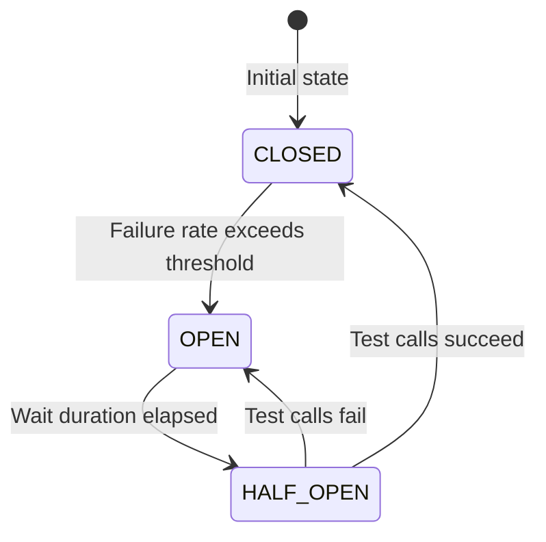
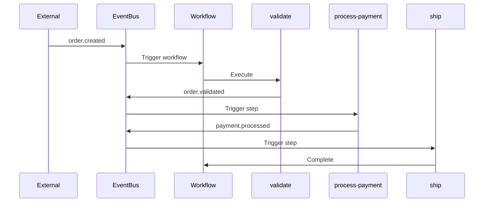
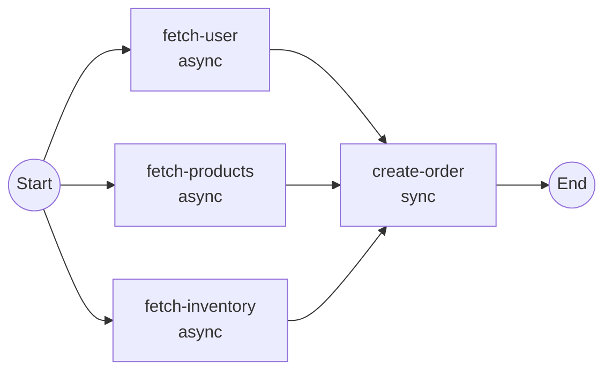

# Advanced Features

This guide covers advanced features of the Firefly Workflow Engine including step dependencies, trigger modes, Resilience4j integration, step-level choreography, parallel execution, and SpEL conditions.

## Step Dependencies with `dependsOn`

The `dependsOn` attribute is the **recommended approach** for controlling step execution order. It provides explicit dependency management with automatic DAG validation.

### Basic Usage

Declare dependencies by specifying the IDs of steps that must complete first:

```java
@Workflow(id = "order-fulfillment")
public class OrderFulfillmentWorkflow {

    @WorkflowStep(id = "validate")
    public Mono<Map<String, Object>> validate(WorkflowContext ctx) {
        // Root step - no dependencies, executes first
        return Mono.just(Map.of("valid", true));
    }

    @WorkflowStep(id = "check-inventory", dependsOn = {"validate"})
    public Mono<Map<String, Object>> checkInventory(WorkflowContext ctx) {
        // Executes after validate completes
        return Mono.just(Map.of("inStock", true));
    }

    @WorkflowStep(id = "process-payment", dependsOn = {"validate"})
    public Mono<Map<String, Object>> processPayment(WorkflowContext ctx) {
        // Also executes after validate - parallel with check-inventory
        return Mono.just(Map.of("paid", true));
    }

    @WorkflowStep(id = "ship", dependsOn = {"check-inventory", "process-payment"})
    public Mono<Map<String, Object>> ship(WorkflowContext ctx) {
        // Waits for BOTH check-inventory AND process-payment
        return Mono.just(Map.of("shipped", true));
    }
}
```

### Execution Layers

Steps are organized into execution layers based on their dependencies:

| Layer | Steps | Description |
|-------|-------|-------------|
| 0 | `validate` | Root steps (no dependencies) |
| 1 | `check-inventory`, `process-payment` | Steps depending only on Layer 0 |
| 2 | `ship` | Steps depending on Layer 1 |

**Key Benefits:**
- Steps in the same layer can execute **in parallel** (if marked `async = true`)
- Clear visualization of workflow structure
- Automatic optimization of execution order

### Validation

The workflow engine validates dependencies during registration:

1. **Missing Dependencies**: All referenced step IDs must exist
   ```java
   // ERROR: "payment" step doesn't exist
   @WorkflowStep(id = "ship", dependsOn = {"payment"})
   ```

2. **Circular Dependencies**: No cycles allowed
   ```java
   // ERROR: Circular dependency detected
   @WorkflowStep(id = "step-a", dependsOn = {"step-b"})
   @WorkflowStep(id = "step-b", dependsOn = {"step-a"})
   ```

Validation errors throw `WorkflowValidationException` with descriptive messages.

### Combining with Event-Driven Choreography

The `dependsOn` attribute works seamlessly with event-driven patterns:

```java
@WorkflowStep(
    id = "process-payment",
    dependsOn = {"validate"},                    // Explicit dependency
    triggerMode = StepTriggerMode.EVENT,         // Event-driven
    inputEventType = "order.validated",          // Triggered by event
    outputEventType = "payment.processed"        // Emits event
)
public Mono<PaymentResult> processPayment(WorkflowContext ctx) {
    return paymentService.process(ctx.getInput("order", Order.class));
}
```

### Migration from `order` Attribute

The `order` attribute is still supported for backward compatibility:

| Approach | Recommended | Use Case |
|----------|-------------|----------|
| `dependsOn` | ✅ Yes | New workflows, explicit dependencies |
| `order` | ⚠️ Legacy | Existing workflows, simple sequences |

**Migration Example:**

```java
// Before (order-based)
@WorkflowStep(id = "step-a", order = 1)
@WorkflowStep(id = "step-b", order = 2)
@WorkflowStep(id = "step-c", order = 3)

// After (dependency-based) - Recommended
@WorkflowStep(id = "step-a")
@WorkflowStep(id = "step-b", dependsOn = {"step-a"})
@WorkflowStep(id = "step-c", dependsOn = {"step-b"})
```

When both `order` and `dependsOn` are specified, **dependencies take precedence**.

## Step Trigger Modes

The `StepTriggerMode` enum controls how a step can be invoked:

### Available Modes

| Mode | Description | Use Case |
|------|-------------|----------|
| `EVENT` | Triggered by events only | Event-driven choreography (recommended) |
| `PROGRAMMATIC` | Invoked via API only | Synchronous request-response |
| `BOTH` | Supports both patterns | Maximum flexibility (default) |

### Usage Examples

```java
// Event-driven step (recommended for choreography)
@WorkflowStep(
    id = "validate",
    triggerMode = StepTriggerMode.EVENT,
    inputEventType = "order.created",
    outputEventType = "order.validated"
)
public Mono<ValidationResult> validate(WorkflowContext ctx) { ... }

// Programmatic step (for API-driven workflows)
@WorkflowStep(
    id = "manual-review",
    triggerMode = StepTriggerMode.PROGRAMMATIC
)
public Mono<ReviewResult> manualReview(WorkflowContext ctx) { ... }

// Flexible step (supports both patterns)
@WorkflowStep(
    id = "process",
    triggerMode = StepTriggerMode.BOTH,
    inputEventType = "order.validated"  // Can also be triggered by event
)
public Mono<ProcessResult> process(WorkflowContext ctx) { ... }
```

### Checking Trigger Mode

```java
StepTriggerMode mode = StepTriggerMode.EVENT;

if (mode.allowsEventTrigger()) {
    // Step can be triggered by events
}

if (mode.allowsProgrammaticTrigger()) {
    // Step can be invoked via API
}
```

### Best Practices

1. **Prefer `EVENT` mode** for event-driven choreography (the primary pattern)
2. **Use `PROGRAMMATIC`** for steps that require synchronous API calls
3. **Use `BOTH`** when migrating from programmatic to event-driven patterns
4. **Document the expected invocation pattern** in step descriptions

## Resilience4j Integration

The workflow engine integrates with Resilience4j to provide fault tolerance patterns for step execution.

### Enabling Resilience

Resilience is enabled by default. Configure it in `application.yml`:

```yaml
firefly:
  workflow:
    resilience:
      enabled: true
      circuit-breaker:
        enabled: true
        failure-rate-threshold: 50
        slow-call-rate-threshold: 100
        slow-call-duration-threshold: PT60S
        permitted-number-of-calls-in-half-open-state: 10
        minimum-number-of-calls: 10
        sliding-window-type: COUNT_BASED
        sliding-window-size: 100
        wait-duration-in-open-state: PT60S
        automatic-transition-from-open-to-half-open-enabled: true
      rate-limiter:
        enabled: false
        limit-for-period: 50
        limit-refresh-period: PT1S
        timeout-duration: PT5S
      bulkhead:
        enabled: false
        max-concurrent-calls: 25
        max-wait-duration: PT0S
      time-limiter:
        enabled: true
        timeout-duration: PT5M
        cancel-running-future: true
```

### Circuit Breaker

The circuit breaker prevents cascading failures by stopping calls to failing steps:



**Configuration Options:**

| Property | Default | Description |
|----------|---------|-------------|
| `failure-rate-threshold` | 50 | Failure percentage to open circuit |
| `slow-call-rate-threshold` | 100 | Slow call percentage to open circuit |
| `slow-call-duration-threshold` | PT60S | Duration to consider a call slow |
| `minimum-number-of-calls` | 10 | Minimum calls before calculating rate |
| `sliding-window-size` | 100 | Number of calls in sliding window |
| `wait-duration-in-open-state` | PT60S | Time to wait before half-open |

### Rate Limiter

Controls the rate of step executions:

```yaml
firefly:
  workflow:
    resilience:
      rate-limiter:
        enabled: true
        limit-for-period: 50      # 50 calls per period
        limit-refresh-period: PT1S # Refresh every second
        timeout-duration: PT5S     # Wait up to 5s for permit
```

### Bulkhead

Limits concurrent step executions:

```yaml
firefly:
  workflow:
    resilience:
      bulkhead:
        enabled: true
        max-concurrent-calls: 25   # Max 25 concurrent executions
        max-wait-duration: PT0S    # Don't wait for permit
```

### Time Limiter

Enforces timeouts on step execution:

```yaml
firefly:
  workflow:
    resilience:
      time-limiter:
        enabled: true
        timeout-duration: PT5M     # 5 minute timeout
        cancel-running-future: true
```

### Per-Step Resilience

Resilience patterns are applied per step with unique identifiers:
- Circuit breaker name: `{workflowId}:{stepId}`
- Rate limiter name: `{workflowId}:{stepId}`
- Bulkhead name: `{workflowId}:{stepId}`

This ensures that failures in one step don't affect other steps.

## Step-Level Choreography

Step-level choreography allows steps to be triggered independently via events or API.

### Event-Driven Steps

Configure steps to listen for and emit events:

```java
@Workflow(
    id = "order-processing",
    triggerMode = TriggerMode.ASYNC,
    triggerEventType = "order.created"
)
public class OrderProcessingWorkflow {

    @WorkflowStep(
        id = "validate",
        order = 1,
        outputEventType = "order.validated"
    )
    public Mono<Map<String, Object>> validate(WorkflowContext ctx) {
        return Mono.just(Map.of("valid", true));
    }

    @WorkflowStep(
        id = "process-payment",
        order = 2,
        inputEventType = "order.validated",
        outputEventType = "payment.processed"
    )
    public Mono<Map<String, Object>> processPayment(WorkflowContext ctx) {
        return Mono.just(Map.of("paymentId", "PAY-123"));
    }

    @WorkflowStep(
        id = "ship",
        order = 3,
        inputEventType = "payment.processed"
    )
    public Mono<Map<String, Object>> ship(WorkflowContext ctx) {
        return Mono.just(Map.of("shipped", true));
    }
}
```

### Choreography Flow



### Manual Step Triggering

Trigger steps via REST API:

```bash
POST /api/workflows/{workflowId}/instances/{instanceId}/steps/{stepId}/trigger
Content-Type: application/json

{
  "input": {"additionalData": "value"}
}
```

Or programmatically:

```java
workflowEngine.triggerStep(
    "order-processing",
    instanceId,
    "process-payment",
    Map.of("additionalData", "value"),
    "api"  // triggeredBy
);
```

### Step State Tracking

Each step maintains independent state:

```java
// Get step state
StepState state = workflowEngine.getStepState(
    "order-processing",
    instanceId,
    "process-payment"
).block();

// State includes:
// - status: PENDING, RUNNING, COMPLETED, FAILED, SKIPPED, RETRYING
// - triggeredBy: "event:order.validated", "api", "workflow"
// - input, output, errorMessage
// - startedAt, completedAt, durationMs
```

## Parallel Execution

Execute multiple steps concurrently using `async = true` combined with `dependsOn` for optimal parallel execution.

### Dependency-Based Parallel Execution (Recommended)

Using `dependsOn`, steps in the same execution layer automatically run in parallel:

```java
@Workflow(id = "parallel-workflow")
public class ParallelWorkflow {

    // Layer 0: Root steps - all execute in parallel
    @WorkflowStep(id = "fetch-user", async = true)
    public Mono<User> fetchUser(WorkflowContext ctx) {
        return userService.findById(ctx.getInput("userId", String.class));
    }

    @WorkflowStep(id = "fetch-products", async = true)
    public Mono<List<Product>> fetchProducts(WorkflowContext ctx) {
        return productService.findAll();
    }

    @WorkflowStep(id = "fetch-inventory", async = true)
    public Mono<Inventory> fetchInventory(WorkflowContext ctx) {
        return inventoryService.getAvailable();
    }

    // Layer 1: Depends on all Layer 0 steps
    @WorkflowStep(
        id = "create-order",
        dependsOn = {"fetch-user", "fetch-products", "fetch-inventory"}
    )
    public Mono<Order> createOrder(WorkflowContext ctx) {
        User user = ctx.getStepOutput("fetch-user", User.class);
        List<Product> products = ctx.getStepOutput("fetch-products", List.class);
        Inventory inventory = ctx.getStepOutput("fetch-inventory", Inventory.class);
        return orderService.create(user, products, inventory);
    }
}
```

### Parallel Execution Flow



### Execution Layers and Parallelism

With `dependsOn`, the engine organizes steps into layers:

| Layer | Steps | Execution |
|-------|-------|-----------|
| 0 | `fetch-user`, `fetch-products`, `fetch-inventory` | Parallel (all async) |
| 1 | `create-order` | Sequential (waits for Layer 0) |

### Parallel Step Behavior

- Steps in the same layer with `async = true` execute in parallel
- Steps with `dependsOn` wait for all dependencies to complete
- Outputs from parallel steps are available via `ctx.getStepOutput()`
- If any parallel step fails, the workflow fails

### Legacy Order-Based Parallel Execution

For backward compatibility, order-based parallel execution is still supported:

```java
// Legacy approach - still works but dependsOn is preferred
@WorkflowStep(id = "fetch-user", order = 1, async = true)
@WorkflowStep(id = "fetch-products", order = 1, async = true)  // Same order = parallel
@WorkflowStep(id = "create-order", order = 2)  // Higher order = waits
```

## SpEL Conditions

Use Spring Expression Language (SpEL) to conditionally execute steps.

### Available Variables

| Variable | Type | Description |
|----------|------|-------------|
| `#ctx` | WorkflowContext | The workflow context object |
| `#input` | Map<String, Object> | Workflow input values |
| `#data` | Map<String, Object> | Shared context data |

### Condition Examples

```java
// Skip if amount is zero or negative
@WorkflowStep(
    id = "process-payment",
    condition = "#input['amount'] > 0"
)

// Execute only for premium customers
@WorkflowStep(
    id = "premium-processing",
    condition = "#input['tier'] == 'premium'"
)

// Check shared context data
@WorkflowStep(
    id = "send-notification",
    condition = "#data['validated'] == true"
)

// Complex condition with context methods
@WorkflowStep(
    id = "optional-step",
    condition = "#ctx.has('skipOptional') ? !#ctx.get('skipOptional', Boolean.class) : true"
)

// Check previous step output
@WorkflowStep(
    id = "refund",
    condition = "#ctx.getStepOutput('validate').get('requiresRefund') == true"
)
```

### Setting Context Data

Set data in one step for use in conditions:

```java
@WorkflowStep(id = "validate", order = 1)
public Mono<Map<String, Object>> validate(WorkflowContext ctx) {
    boolean isValid = performValidation();
    ctx.set("validated", isValid);  // Available in #data
    return Mono.just(Map.of("valid", isValid));
}

@WorkflowStep(
    id = "process",
    order = 2,
    condition = "#data['validated'] == true"
)
public Mono<Map<String, Object>> process(WorkflowContext ctx) {
    // Only executes if validated == true
    return Mono.just(Map.of("processed", true));
}
```

## Retry Configuration

Configure automatic retries for transient failures.

### Step-Level Retry

```java
@WorkflowStep(
    id = "call-external-api",
    maxRetries = 3,
    retryDelayMs = 1000  // 1 second between retries
)
public Mono<Map<String, Object>> callExternalApi(WorkflowContext ctx) {
    return externalApiClient.call()
        .map(response -> Map.of("data", response));
}
```

### Workflow-Level Defaults

```java
@Workflow(
    id = "my-workflow",
    maxRetries = 5,        // Default for all steps
    retryDelayMs = 2000    // Default delay
)
public class MyWorkflow {
    // Steps inherit these defaults unless overridden
}
```

### Global Configuration

```yaml
firefly:
  workflow:
    retry:
      max-attempts: 3
      initial-delay: PT1S
      max-delay: PT5M
      multiplier: 2.0  # Exponential backoff
```

## Lifecycle Hooks

Respond to workflow and step lifecycle events.

```java
@Workflow(id = "my-workflow")
public class MyWorkflow {

    @OnStepComplete
    public void onStepComplete(WorkflowContext ctx, StepExecution step) {
        log.info("Step {} completed: {}", step.stepId(), step.status());
        // Send metrics, update external systems, etc.
    }

    @OnWorkflowComplete
    public void onWorkflowComplete(WorkflowContext ctx) {
        log.info("Workflow {} completed", ctx.getInstanceId());
        // Cleanup, notifications, etc.
    }

    @OnWorkflowError
    public void onWorkflowError(WorkflowContext ctx, Throwable error) {
        log.error("Workflow {} failed: {}", ctx.getInstanceId(), error.getMessage());
        // Alert, compensate, etc.
    }
}
```

## Programmatic Step Handlers

For reusable step logic, implement `StepHandler<T>`:

```java
@Component("validateOrderStep")
public class ValidateOrderStepHandler implements StepHandler<ValidationResult> {

    private final ValidationService validationService;

    @Override
    public Mono<ValidationResult> execute(WorkflowContext context) {
        String orderId = context.getInput("orderId", String.class);
        return validationService.validate(orderId);
    }

    @Override
    public boolean shouldSkip(WorkflowContext context) {
        return "internal".equals(context.getInput("source", String.class));
    }
}
```

Register programmatically:

```java
WorkflowDefinition definition = WorkflowDefinition.builder()
    .workflowId("programmatic-workflow")
    .name("Programmatic Workflow")
    .addStep(WorkflowStepDefinition.builder()
        .stepId("validate")
        .name("Validate Order")
        .order(1)
        .handlerBeanName("validateOrderStep")
        .build())
    .build();

workflowEngine.registerWorkflow(definition);
```

## Scheduled Workflows (Cron)

Schedule workflows to run automatically using cron expressions or fixed intervals.

### @ScheduledWorkflow Annotation

```java
@Workflow(id = "daily-report")
@ScheduledWorkflow(
    cron = "0 0 2 * * *",              // Run at 2 AM daily
    zone = "America/New_York",
    description = "Daily report generation",
    input = "{\"type\": \"daily\"}"
)
public class DailyReportWorkflow {
    @WorkflowStep(id = "generate")
    public Mono<Map<String, Object>> generate(WorkflowContext ctx) {
        return reportService.generateDaily();
    }
}
```

### Annotation Attributes

| Attribute | Type | Description |
|-----------|------|-------------|
| `cron` | String | Cron expression (Spring format) |
| `zone` | String | Timezone (default: system default) |
| `fixedDelay` | long | Fixed delay in ms between runs |
| `fixedRate` | long | Fixed rate in ms between runs |
| `initialDelay` | long | Initial delay in ms before first run |
| `input` | String | JSON input for the workflow |
| `description` | String | Description for logging |

### Multiple Schedules

Use `@ScheduledWorkflows` for multiple schedules:

```java
@Workflow(id = "multi-schedule")
@ScheduledWorkflows({
    @ScheduledWorkflow(cron = "0 0 * * * *", input = "{\"mode\": \"hourly\"}"),
    @ScheduledWorkflow(cron = "0 0 0 * * *", input = "{\"mode\": \"daily\"}")
})
public class MultiScheduleWorkflow { ... }
```

### Configuration

```yaml
firefly:
  workflow:
    scheduling:
      enabled: true
      pool-size: 5
```

## Dry-Run Mode

Test workflows without executing side effects.

### Starting in Dry-Run Mode

```bash
POST /api/v1/workflows/order-processing/start
{
  "input": {"orderId": "TEST-123"},
  "dryRun": true
}
```

### Checking Dry-Run in Steps

```java
@WorkflowStep(id = "send-email")
public Mono<Map<String, Object>> sendEmail(WorkflowContext ctx) {
    if (ctx.isDryRun()) {
        log.info("DRY-RUN: Would send email to {}", ctx.getInput("email"));
        return Mono.just(Map.of("sent", false, "dryRun", true));
    }
    return emailService.send(ctx.getInput("email", String.class))
        .map(result -> Map.of("sent", true));
}
```

### Programmatic Dry-Run

```java
Mono<WorkflowInstance> instance = workflowEngine.startWorkflow(
    "order-processing",
    Map.of("orderId", "TEST-123"),
    null,       // correlationId
    "test",     // triggeredBy
    true        // dryRun
);
```

## Workflow Suspension & Resumption

Pause workflows during incidents and resume them later.

### Suspend a Workflow

```bash
POST /api/v1/workflows/order-processing/instances/inst-123/suspend
{
  "reason": "Downstream payment service outage"
}
```

### Resume a Workflow

```bash
POST /api/v1/workflows/order-processing/instances/inst-123/resume
```

### Programmatic Suspension

```java
// Suspend
Mono<WorkflowInstance> suspended = workflowEngine.suspendWorkflow(
    "order-processing",
    instanceId,
    "Manual suspension for investigation"
);

// Resume
Mono<WorkflowInstance> resumed = workflowEngine.resumeWorkflow(
    "order-processing",
    instanceId
);

// Find all suspended instances
Flux<WorkflowInstance> suspended = workflowEngine.findSuspendedInstances();
```

### Status Guards

```java
WorkflowStatus status = instance.status();
if (status.canSuspend()) {
    // Workflow can be suspended (RUNNING or WAITING)
}
if (status.canResume()) {
    // Workflow can be resumed (SUSPENDED)
}
```

## Dead Letter Queue (DLQ) Management

Manage and replay failed workflows.

### Auto-Save on Failure

When a workflow fails after exhausting retries, it's automatically saved to the DLQ:

```yaml
firefly:
  workflow:
    dlq:
      enabled: true
      auto-save-on-failure: true
      retention-period: P30D
```

### View DLQ Entries

```bash
GET /api/v1/workflows/dlq
GET /api/v1/workflows/dlq?workflowId=order-processing
```

### Replay a Failed Workflow

```bash
POST /api/v1/workflows/dlq/dlq-123/replay
{
  "modifiedInput": {
    "retryToken": "new-token"
  }
}
```

### Programmatic DLQ Access

```java
@Autowired
private DeadLetterService dlqService;

// List entries
Flux<DeadLetterEntry> entries = dlqService.getAllEntries();

// Replay an entry
Mono<ReplayResult> result = dlqService.replay("dlq-123");

// Replay with modified input
Mono<ReplayResult> result = dlqService.replay(
    "dlq-123",
    Map.of("retryToken", "new-value")
);

// Delete an entry
Mono<Boolean> deleted = dlqService.delete("dlq-123");
```

## Topology Visualization

Get workflow DAG for frontend visualization.

### Get Workflow Topology

```bash
GET /api/v1/workflows/order-processing/topology
```

**Response (for React Flow / Mermaid.js):**

```json
{
  "workflowId": "order-processing",
  "nodes": [
    {"id": "validate", "label": "Validate", "layer": 0},
    {"id": "process", "label": "Process", "layer": 1}
  ],
  "edges": [
    {"source": "validate", "target": "process"}
  ]
}
```

### Instance Topology with Status

```bash
GET /api/v1/workflows/order-processing/instances/inst-123/topology
```

Returns the same structure with `status` fields populated.

### Programmatic Access

```java
Optional<WorkflowTopologyResponse> topology = 
    workflowService.getTopology("order-processing");

Mono<WorkflowTopologyResponse> instanceTopology =
    workflowService.getTopology("order-processing", instanceId);
```

## Durable Execution Features

The following features require event sourcing to be enabled (`firefly.workflow.eventsourcing.enabled: true`). They provide Temporal.io-like durable execution capabilities for long-running business processes.

### Signals

Signals allow external systems to send named data to running workflow instances. Steps can block until a signal arrives, and signals are buffered if they arrive before any step waits for them.

#### Sending a Signal

Via REST API:

```bash
POST /api/v1/workflows/order-processing/instances/inst-789/signal
Content-Type: application/json

{
  "signalName": "approval-received",
  "payload": {
    "approvedBy": "manager@company.com",
    "approved": true
  }
}
```

Or programmatically:

```java
workflowEngine.signal(
    "order-processing",
    instanceId,
    "approval-received",
    Map.of("approvedBy", "manager@company.com", "approved", true)
);
```

#### Waiting for a Signal in a Step

Use the `@WaitForSignal` annotation to pause a step until a named signal arrives:

```java
@WorkflowStep(id = "wait-for-approval", dependsOn = {"submit-request"})
@WaitForSignal(name = "approval-received", timeoutDuration = "P7D", timeoutAction = FAIL)
public Mono<Map<String, Object>> waitForApproval(WorkflowContext ctx) {
    Map<String, Object> signal = ctx.getSignal("approval-received");
    boolean approved = (boolean) signal.get("approved");
    return Mono.just(Map.of("approved", approved));
}
```

#### Signal Buffering

If a signal arrives before any step waits for it, the signal is stored in the `pendingSignals` buffer. When a step declares a wait, the buffer is checked first. Configure the buffer size:

```yaml
firefly:
  workflow:
    signals:
      enabled: true
      buffer-size: 100
```

#### Signal with Timeout

Combine a signal wait with a timeout for escalation patterns:

```java
@WorkflowStep(id = "wait-for-payment")
@WaitForSignal(
    name = "payment-confirmed",
    timeoutDuration = "PT24H",
    timeoutAction = ESCALATE  // or FAIL, SKIP, CONTINUE
)
public Mono<Map<String, Object>> waitForPayment(WorkflowContext ctx) {
    if (ctx.isTimedOut()) {
        return Mono.just(Map.of("escalated", true));
    }
    return Mono.just(ctx.getSignal("payment-confirmed"));
}
```

### Durable Timers

Per-instance timers that survive process restarts. Timer state is persisted as domain events and a materialized projection is polled by the `TimerSchedulerService`.

#### Timer Types

| Type | Description | Example |
|------|-------------|---------|
| Duration-based | Fire after a relative duration | "fire in 7 days" |
| Absolute | Fire at a specific instant | "fire at 2026-03-01T09:00:00Z" |
| Recurring | Re-registers after each fire | "fire every hour" |

#### Using Timers in Steps

```java
@WorkflowStep(id = "schedule-reminder", dependsOn = {"create-order"})
public Mono<Map<String, Object>> scheduleReminder(WorkflowContext ctx) {
    // Duration-based timer
    ctx.registerTimer("payment-reminder", Duration.ofDays(3));

    // Absolute timer
    ctx.registerTimer("deadline", Instant.parse("2026-03-01T09:00:00Z"));

    return Mono.just(Map.of("reminderScheduled", true));
}

@WorkflowStep(id = "handle-reminder")
@WaitForTimer("payment-reminder")
public Mono<Map<String, Object>> handleReminder(WorkflowContext ctx) {
    return notificationService.sendReminder(ctx.getInput("email", String.class))
        .map(result -> Map.of("reminderSent", true));
}
```

#### Timer Configuration

```yaml
firefly:
  workflow:
    timers:
      enabled: true
      poll-interval: PT1S   # How often to check for due timers
      batch-size: 50         # Max timers to fire per poll cycle
```

### Child Workflows

Parent workflows can spawn child workflows, wait for their completion, and use their results. Child workflows are separate `WorkflowAggregate` instances with their own event history.

#### Using @ChildWorkflow

```java
@WorkflowStep(id = "process-items", dependsOn = {"validate-order"})
@ChildWorkflow(workflowId = "item-processing", waitForCompletion = true)
public Mono<Map<String, Object>> processItems(WorkflowContext ctx) {
    List<String> itemIds = ctx.getInput("itemIds", List.class);

    // Spawn child workflows for each item
    List<Mono<Object>> children = itemIds.stream()
        .map(itemId -> ctx.spawnChildWorkflow(
            "item-processing",
            Map.of("itemId", itemId)
        ))
        .toList();

    return Flux.merge(children)
        .collectList()
        .map(results -> Map.of("processedItems", results));
}
```

#### Parent-Child Lifecycle

- Parent records `ChildWorkflowSpawnedEvent` when spawning a child
- Child is a separate `WorkflowAggregate` with its own event history
- On child completion, the engine calls `parent.completeChildWorkflow()`
- **Cascading cancellation**: Cancelling the parent automatically cancels all active children
- **Child failure handling**: Configurable to fail parent, retry child, or trigger compensation

#### Nesting Depth Limit

To prevent runaway recursion, child workflows have a configurable maximum nesting depth:

```yaml
firefly:
  workflow:
    child-workflows:
      enabled: true
      max-depth: 5
```

### Continue-As-New

Long-running workflows accumulate events over time. `Continue-As-New` resets the event history by completing the current aggregate and starting a new one with the same workflow identity.

#### Manual Continue-As-New

```java
@WorkflowStep(id = "check-and-continue")
public Mono<Map<String, Object>> checkAndContinue(WorkflowContext ctx) {
    int iteration = ctx.getInput("iteration", Integer.class);

    if (shouldContinue(iteration)) {
        ctx.continueAsNew(Map.of("iteration", iteration + 1));
        return Mono.empty(); // workflow will restart with new input
    }

    return Mono.just(Map.of("finalIteration", iteration));
}
```

#### Automatic Continue-As-New

Configure a threshold to trigger continue-as-new automatically when the event count exceeds the limit:

```yaml
firefly:
  workflow:
    eventsourcing:
      max-events-before-continue-as-new: 1000
```

When triggered:
- The current aggregate is marked `COMPLETED` with a `ContinueAsNewEvent`
- A new aggregate is created with the same `workflowId` and `correlationId`, plus a `previousRunId` reference
- Active timers and pending signals are migrated to the new run

### Side Effects

Side effects capture the result of non-deterministic operations (such as generating UUIDs or reading the current time) so that they produce the same value during replay.

#### Using ctx.sideEffect()

```java
@WorkflowStep(id = "generate-id")
public Mono<Map<String, Object>> generateId(WorkflowContext ctx) {
    // First execution: supplier runs, value stored as SideEffectRecordedEvent
    // Replay: stored value returned, supplier NOT called
    String uniqueId = ctx.sideEffect("order-id", () -> UUID.randomUUID().toString());
    Instant timestamp = ctx.sideEffect("created-at", () -> Instant.now());

    return Mono.just(Map.of(
        "orderId", uniqueId,
        "createdAt", timestamp.toString()
    ));
}
```

The first execution runs the supplier and records a `SideEffectRecordedEvent`. On replay, the stored value is returned without invoking the supplier, ensuring deterministic behavior.

### Heartbeating

Long-running steps can report progress via heartbeats. This allows the engine to distinguish between a step that is stuck and one that is making progress, and provides resume information on recovery.

#### Using ctx.heartbeat()

```java
@WorkflowStep(id = "process-large-dataset", timeoutMs = 3600000)
public Mono<Map<String, Object>> processLargeDataset(WorkflowContext ctx) {
    List<Record> records = loadRecords();
    int lastProcessed = ctx.getLastHeartbeatDetails("lastIndex", Integer.class, 0);

    for (int i = lastProcessed; i < records.size(); i++) {
        process(records.get(i));
        ctx.heartbeat(Map.of("lastIndex", i, "progress", (i * 100) / records.size()));
    }

    return Mono.just(Map.of("totalProcessed", records.size()));
}
```

Key behaviors:
- Heartbeats are stored as `HeartbeatRecordedEvent` (throttled to avoid excessive writes)
- Heartbeat timeout is separate from step timeout
- On recovery, the last heartbeat details are available via `ctx.getLastHeartbeatDetails()` for resuming work

```yaml
firefly:
  workflow:
    heartbeat:
      enabled: true
      throttle-interval: PT5S  # Minimum interval between persisted heartbeats
```

### Compensation Orchestration

When a workflow step fails, the engine can automatically run compensation logic on previously completed steps in reverse order. This provides saga-like rollback behavior within the durable execution model.

#### Defining Compensation Steps

Use the `@CompensationStep` annotation to declare compensation logic for a step:

```java
@Workflow(id = "order-fulfillment")
public class OrderFulfillmentWorkflow {

    @WorkflowStep(id = "reserve-inventory", dependsOn = {"validate"})
    public Mono<Map<String, Object>> reserveInventory(WorkflowContext ctx) {
        return inventoryService.reserve(ctx.getInput("items", List.class))
            .map(res -> Map.of("reservationId", res.id()));
    }

    @CompensationStep(compensates = "reserve-inventory")
    public Mono<Void> releaseInventory(WorkflowContext ctx) {
        String reservationId = ctx.getStepOutput("reserve-inventory", Map.class)
            .get("reservationId").toString();
        return inventoryService.release(reservationId);
    }

    @WorkflowStep(id = "charge-payment", dependsOn = {"reserve-inventory"})
    public Mono<Map<String, Object>> chargePayment(WorkflowContext ctx) {
        return paymentService.charge(ctx.getInput("amount", BigDecimal.class))
            .map(res -> Map.of("chargeId", res.id()));
    }

    @CompensationStep(compensates = "charge-payment")
    public Mono<Void> refundPayment(WorkflowContext ctx) {
        String chargeId = ctx.getStepOutput("charge-payment", Map.class)
            .get("chargeId").toString();
        return paymentService.refund(chargeId);
    }
}
```

#### Compensation Policies

| Policy | Behavior |
|--------|----------|
| `STRICT_SEQUENTIAL` | Compensate in reverse order, stop on first compensation error |
| `BEST_EFFORT` | Compensate all steps in reverse order, collect all errors |
| `SKIP` | No compensation, workflow fails immediately |

Configure the default policy:

```yaml
firefly:
  workflow:
    compensation:
      enabled: true
      default-policy: STRICT_SEQUENTIAL
```

#### Compensation Flow

When a step fails and compensation is triggered:

1. `CompensationStartedEvent` is recorded with the failed step and policy
2. Completed steps are compensated in reverse order
3. Each successful compensation records a `CompensationStepCompletedEvent`
4. After all compensations complete (or on first failure in `STRICT_SEQUENTIAL`), a `WorkflowFailedEvent` is recorded

### Search Attributes

Search attributes are custom indexed fields that allow you to discover and filter workflow instances by business-relevant data.

#### Setting Search Attributes

```java
@WorkflowStep(id = "process-order")
public Mono<Map<String, Object>> processOrder(WorkflowContext ctx) {
    String customerId = ctx.getInput("customerId", String.class);
    String region = ctx.getInput("region", String.class);

    ctx.upsertSearchAttribute("customerId", customerId);
    ctx.upsertSearchAttribute("region", region);
    ctx.upsertSearchAttribute("orderStatus", "PROCESSING");

    return orderService.process(ctx.getInput("orderId", String.class))
        .map(result -> Map.of("processed", true));
}
```

Each call records a `SearchAttributeUpdatedEvent` in the event history. A projection materializes these attributes into an indexed R2DBC table for efficient querying.

#### Searching by Attributes

Via REST API:

```bash
GET /api/v1/workflows/search?customerId=CUST-123&region=us-east
```

Or programmatically:

```java
Flux<WorkflowInstance> instances = workflowEngine.searchByAttributes(
    Map.of("customerId", "CUST-123", "region", "us-east")
);
```

```yaml
firefly:
  workflow:
    search-attributes:
      enabled: true
```

### Queries

Queries provide read-only inspection of running workflow internal state. Both built-in and custom queries are supported.

#### Built-in Queries

The engine provides several built-in queries:

| Query Name | Description |
|------------|-------------|
| `getStatus` | Current workflow status |
| `getCurrentStep` | Currently executing step |
| `getStepHistory` | All step execution records |
| `getContext` | Workflow context data |
| `getSearchAttributes` | Current search attribute values |

#### Custom Queries

Define custom queries by annotating methods with `@WorkflowQuery`:

```java
@Workflow(id = "order-processing")
public class OrderProcessingWorkflow {

    @WorkflowQuery("orderSummary")
    public Map<String, Object> getOrderSummary(WorkflowContext ctx) {
        return Map.of(
            "orderId", ctx.getInput("orderId", String.class),
            "status", ctx.get("orderStatus", String.class),
            "itemCount", ctx.get("itemCount", Integer.class),
            "totalAmount", ctx.get("totalAmount", BigDecimal.class)
        );
    }

    @WorkflowQuery("processingProgress")
    public Map<String, Object> getProgress(WorkflowContext ctx) {
        int completed = ctx.get("completedItems", Integer.class, 0);
        int total = ctx.get("totalItems", Integer.class, 0);
        return Map.of(
            "completedItems", completed,
            "totalItems", total,
            "percentComplete", total > 0 ? (completed * 100) / total : 0
        );
    }
}
```

#### Executing Queries

Via REST API:

```bash
GET /api/v1/workflows/order-processing/instances/inst-789/query/orderSummary
```

Response:

```json
{
  "orderId": "ORD-123",
  "status": "PROCESSING",
  "itemCount": 5,
  "totalAmount": 299.99
}
```

Or programmatically:

```java
Mono<Map<String, Object>> summary = workflowEngine.query(
    "order-processing",
    instanceId,
    "orderSummary"
);
```

## Next Steps

- [Getting Started](getting-started.md) - Basic tutorial
- [Architecture](architecture.md) - System design
- [Configuration Reference](configuration.md) - All configuration options
- [API Reference](api-reference.md) - REST and Java API documentation
