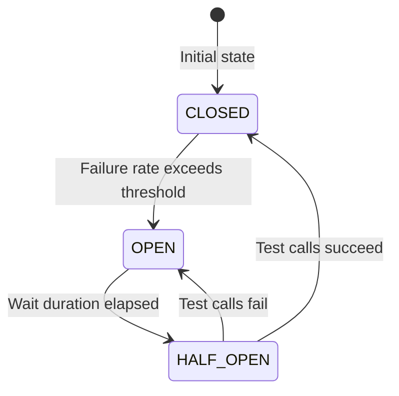
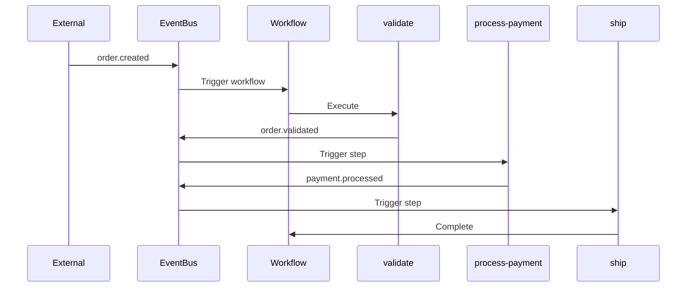
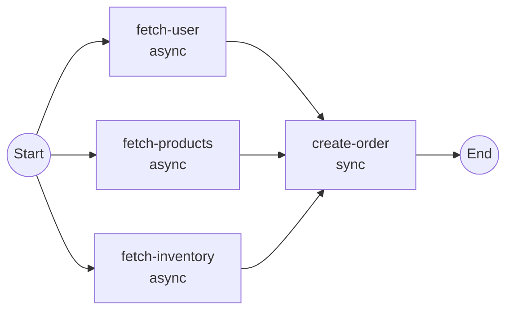

# Advanced Features

This guide covers advanced features of the Firefly Workflow Engine including Resilience4j integration, step-level choreography, parallel execution, and SpEL conditions.

## Resilience4j Integration

The workflow engine integrates with Resilience4j to provide fault tolerance patterns for step execution.

### Enabling Resilience

Resilience is enabled by default. Configure it in `application.yml`:

```yaml
firefly:
  workflow:
    resilience:
      enabled: true
      circuit-breaker:
        enabled: true
        failure-rate-threshold: 50
        slow-call-rate-threshold: 100
        slow-call-duration-threshold: PT60S
        permitted-number-of-calls-in-half-open-state: 10
        minimum-number-of-calls: 10
        sliding-window-type: COUNT_BASED
        sliding-window-size: 100
        wait-duration-in-open-state: PT60S
        automatic-transition-from-open-to-half-open-enabled: true
      rate-limiter:
        enabled: false
        limit-for-period: 50
        limit-refresh-period: PT1S
        timeout-duration: PT5S
      bulkhead:
        enabled: false
        max-concurrent-calls: 25
        max-wait-duration: PT0S
      time-limiter:
        enabled: true
        timeout-duration: PT5M
        cancel-running-future: true
```

### Circuit Breaker

The circuit breaker prevents cascading failures by stopping calls to failing steps:



**Configuration Options:**

| Property | Default | Description |
|----------|---------|-------------|
| `failure-rate-threshold` | 50 | Failure percentage to open circuit |
| `slow-call-rate-threshold` | 100 | Slow call percentage to open circuit |
| `slow-call-duration-threshold` | PT60S | Duration to consider a call slow |
| `minimum-number-of-calls` | 10 | Minimum calls before calculating rate |
| `sliding-window-size` | 100 | Number of calls in sliding window |
| `wait-duration-in-open-state` | PT60S | Time to wait before half-open |

### Rate Limiter

Controls the rate of step executions:

```yaml
firefly:
  workflow:
    resilience:
      rate-limiter:
        enabled: true
        limit-for-period: 50      # 50 calls per period
        limit-refresh-period: PT1S # Refresh every second
        timeout-duration: PT5S     # Wait up to 5s for permit
```

### Bulkhead

Limits concurrent step executions:

```yaml
firefly:
  workflow:
    resilience:
      bulkhead:
        enabled: true
        max-concurrent-calls: 25   # Max 25 concurrent executions
        max-wait-duration: PT0S    # Don't wait for permit
```

### Time Limiter

Enforces timeouts on step execution:

```yaml
firefly:
  workflow:
    resilience:
      time-limiter:
        enabled: true
        timeout-duration: PT5M     # 5 minute timeout
        cancel-running-future: true
```

### Per-Step Resilience

Resilience patterns are applied per step with unique identifiers:
- Circuit breaker name: `{workflowId}:{stepId}`
- Rate limiter name: `{workflowId}:{stepId}`
- Bulkhead name: `{workflowId}:{stepId}`

This ensures that failures in one step don't affect other steps.

## Step-Level Choreography

Step-level choreography allows steps to be triggered independently via events or API.

### Event-Driven Steps

Configure steps to listen for and emit events:

```java
@Workflow(
    id = "order-processing",
    triggerMode = TriggerMode.ASYNC,
    triggerEventType = "order.created"
)
public class OrderProcessingWorkflow {

    @WorkflowStep(
        id = "validate",
        order = 1,
        outputEventType = "order.validated"
    )
    public Mono<Map<String, Object>> validate(WorkflowContext ctx) {
        return Mono.just(Map.of("valid", true));
    }

    @WorkflowStep(
        id = "process-payment",
        order = 2,
        inputEventType = "order.validated",
        outputEventType = "payment.processed"
    )
    public Mono<Map<String, Object>> processPayment(WorkflowContext ctx) {
        return Mono.just(Map.of("paymentId", "PAY-123"));
    }

    @WorkflowStep(
        id = "ship",
        order = 3,
        inputEventType = "payment.processed"
    )
    public Mono<Map<String, Object>> ship(WorkflowContext ctx) {
        return Mono.just(Map.of("shipped", true));
    }
}
```

### Choreography Flow



### Manual Step Triggering

Trigger steps via REST API:

```bash
POST /api/workflows/{workflowId}/instances/{instanceId}/steps/{stepId}/trigger
Content-Type: application/json

{
  "input": {"additionalData": "value"}
}
```

Or programmatically:

```java
workflowEngine.triggerStep(
    "order-processing",
    instanceId,
    "process-payment",
    Map.of("additionalData", "value"),
    "api"  // triggeredBy
);
```

### Step State Tracking

Each step maintains independent state:

```java
// Get step state
StepState state = workflowEngine.getStepState(
    "order-processing",
    instanceId,
    "process-payment"
).block();

// State includes:
// - status: PENDING, RUNNING, COMPLETED, FAILED, SKIPPED, RETRYING
// - triggeredBy: "event:order.validated", "api", "workflow"
// - input, output, errorMessage
// - startedAt, completedAt, durationMs
```

## Parallel Execution

Execute multiple steps concurrently using `async = true`.

### Defining Parallel Steps

```java
@Workflow(id = "parallel-workflow")
public class ParallelWorkflow {

    @WorkflowStep(id = "fetch-user", order = 1, async = true)
    public Mono<User> fetchUser(WorkflowContext ctx) {
        return userService.findById(ctx.getInput("userId", String.class));
    }

    @WorkflowStep(id = "fetch-products", order = 2, async = true)
    public Mono<List<Product>> fetchProducts(WorkflowContext ctx) {
        return productService.findAll();
    }

    @WorkflowStep(id = "fetch-inventory", order = 3, async = true)
    public Mono<Inventory> fetchInventory(WorkflowContext ctx) {
        return inventoryService.getAvailable();
    }

    @WorkflowStep(id = "create-order", order = 4)  // Sync - waits for all async
    public Mono<Order> createOrder(WorkflowContext ctx) {
        User user = ctx.getStepOutput("fetch-user", User.class);
        List<Product> products = ctx.getStepOutput("fetch-products", List.class);
        Inventory inventory = ctx.getStepOutput("fetch-inventory", Inventory.class);
        return orderService.create(user, products, inventory);
    }
}
```

### Parallel Execution Flow



### Parallel Step Behavior

- Consecutive `async = true` steps execute in parallel
- A `sync` step (default) waits for all preceding async steps
- Outputs from parallel steps are available via `ctx.getStepOutput()`
- If any parallel step fails, the workflow fails

## SpEL Conditions

Use Spring Expression Language (SpEL) to conditionally execute steps.

### Available Variables

| Variable | Type | Description |
|----------|------|-------------|
| `#ctx` | WorkflowContext | The workflow context object |
| `#input` | Map<String, Object> | Workflow input values |
| `#data` | Map<String, Object> | Shared context data |

### Condition Examples

```java
// Skip if amount is zero or negative
@WorkflowStep(
    id = "process-payment",
    condition = "#input['amount'] > 0"
)

// Execute only for premium customers
@WorkflowStep(
    id = "premium-processing",
    condition = "#input['tier'] == 'premium'"
)

// Check shared context data
@WorkflowStep(
    id = "send-notification",
    condition = "#data['validated'] == true"
)

// Complex condition with context methods
@WorkflowStep(
    id = "optional-step",
    condition = "#ctx.has('skipOptional') ? !#ctx.get('skipOptional', Boolean.class) : true"
)

// Check previous step output
@WorkflowStep(
    id = "refund",
    condition = "#ctx.getStepOutput('validate').get('requiresRefund') == true"
)
```

### Setting Context Data

Set data in one step for use in conditions:

```java
@WorkflowStep(id = "validate", order = 1)
public Mono<Map<String, Object>> validate(WorkflowContext ctx) {
    boolean isValid = performValidation();
    ctx.set("validated", isValid);  // Available in #data
    return Mono.just(Map.of("valid", isValid));
}

@WorkflowStep(
    id = "process",
    order = 2,
    condition = "#data['validated'] == true"
)
public Mono<Map<String, Object>> process(WorkflowContext ctx) {
    // Only executes if validated == true
    return Mono.just(Map.of("processed", true));
}
```

## Retry Configuration

Configure automatic retries for transient failures.

### Step-Level Retry

```java
@WorkflowStep(
    id = "call-external-api",
    maxRetries = 3,
    retryDelayMs = 1000  // 1 second between retries
)
public Mono<Map<String, Object>> callExternalApi(WorkflowContext ctx) {
    return externalApiClient.call()
        .map(response -> Map.of("data", response));
}
```

### Workflow-Level Defaults

```java
@Workflow(
    id = "my-workflow",
    maxRetries = 5,        // Default for all steps
    retryDelayMs = 2000    // Default delay
)
public class MyWorkflow {
    // Steps inherit these defaults unless overridden
}
```

### Global Configuration

```yaml
firefly:
  workflow:
    retry:
      max-attempts: 3
      initial-delay: PT1S
      max-delay: PT5M
      multiplier: 2.0  # Exponential backoff
```

## Lifecycle Hooks

Respond to workflow and step lifecycle events.

```java
@Workflow(id = "my-workflow")
public class MyWorkflow {

    @OnStepComplete
    public void onStepComplete(WorkflowContext ctx, StepExecution step) {
        log.info("Step {} completed: {}", step.stepId(), step.status());
        // Send metrics, update external systems, etc.
    }

    @OnWorkflowComplete
    public void onWorkflowComplete(WorkflowContext ctx) {
        log.info("Workflow {} completed", ctx.getInstanceId());
        // Cleanup, notifications, etc.
    }

    @OnWorkflowError
    public void onWorkflowError(WorkflowContext ctx, Throwable error) {
        log.error("Workflow {} failed: {}", ctx.getInstanceId(), error.getMessage());
        // Alert, compensate, etc.
    }
}
```

## Programmatic Step Handlers

For reusable step logic, implement `StepHandler<T>`:

```java
@Component("validateOrderStep")
public class ValidateOrderStepHandler implements StepHandler<ValidationResult> {

    private final ValidationService validationService;

    @Override
    public Mono<ValidationResult> execute(WorkflowContext context) {
        String orderId = context.getInput("orderId", String.class);
        return validationService.validate(orderId);
    }

    @Override
    public boolean shouldSkip(WorkflowContext context) {
        return "internal".equals(context.getInput("source", String.class));
    }
}
```

Register programmatically:

```java
WorkflowDefinition definition = WorkflowDefinition.builder()
    .workflowId("programmatic-workflow")
    .name("Programmatic Workflow")
    .addStep(WorkflowStepDefinition.builder()
        .stepId("validate")
        .name("Validate Order")
        .order(1)
        .handlerBeanName("validateOrderStep")
        .build())
    .build();

workflowEngine.registerWorkflow(definition);
```

## Next Steps

- [Getting Started](getting-started.md) - Basic tutorial
- [Architecture](architecture.md) - System design
- [Configuration Reference](configuration.md) - All configuration options
- [API Reference](api-reference.md) - REST and Java API documentation