# Architecture Overview

This document describes the architecture of the Firefly Workflow Engine, including component diagrams, data flow, and integration points.

## High-Level Architecture

The workflow engine follows a layered architecture with clear separation of concerns:

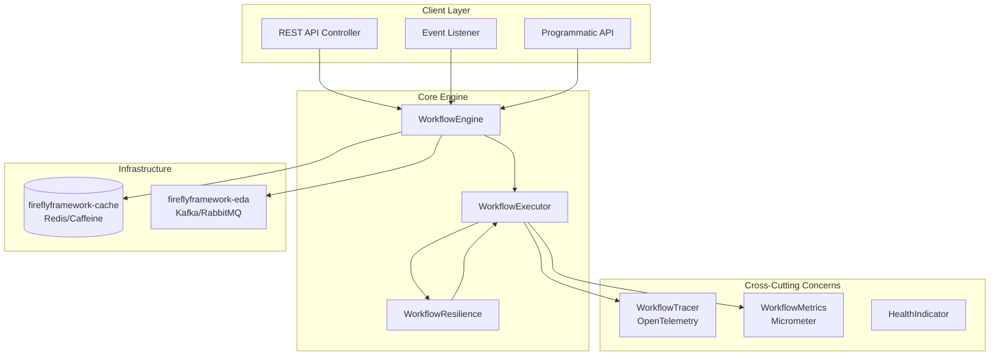

## Component Descriptions

### WorkflowEngine

The main facade providing high-level API for workflow operations:

- `startWorkflow()` - Start a new workflow instance
- `getStatus()` - Get workflow instance status
- `triggerStep()` - Trigger a specific step (choreography)
- `cancelWorkflow()` - Cancel a running workflow
- `retryWorkflow()` - Retry a failed workflow
- `collectResult()` - Get the result of a completed workflow
- `getWorkflowState()` - Get enriched workflow state with step details

### WorkflowExecutor

Executes workflow steps with resilience patterns:

- Manages step execution order via topology-based layers
- Handles parallel step execution within dependency layers
- Evaluates SpEL conditions
- Applies retry logic
- Persists step and workflow state
- Publishes step events

### WorkflowTopology

Manages the dependency graph (DAG) of workflow steps:

- Builds directed acyclic graph from `dependsOn` declarations
- Validates dependencies exist and detects cycles
- Computes execution layers using Kahn's algorithm
- Enables parallel execution of independent steps

### WorkflowResilience

Decorates step execution with Resilience4j patterns:

- **Circuit Breaker**: Prevents cascading failures
- **Rate Limiter**: Controls execution rate
- **Bulkhead**: Limits concurrent executions
- **Time Limiter**: Enforces timeouts

## Workflow Execution Flow

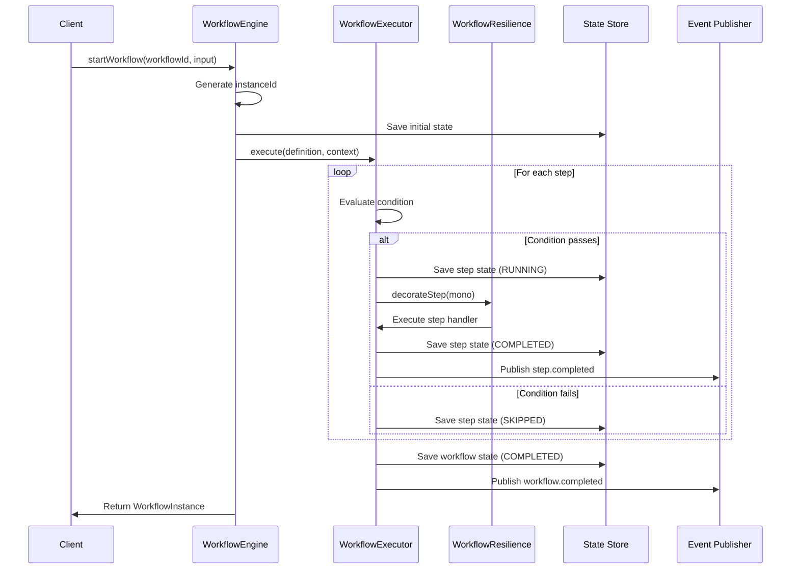

## Topology-Based Execution

The workflow engine uses a **topology-based execution model** where steps are organized into execution layers based on their dependencies. This is the recommended approach for controlling step execution order.

### Dependency Graph (DAG)

Steps declare dependencies using the `dependsOn` attribute, forming a Directed Acyclic Graph (DAG):

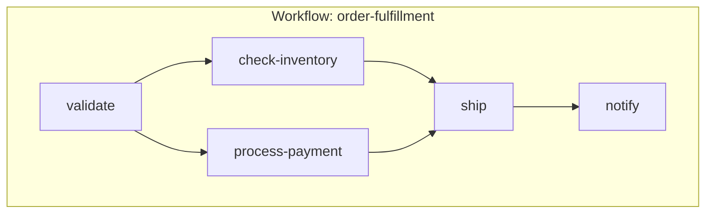

### Execution Layers

The `WorkflowTopology` class uses **Kahn's algorithm** to compute execution layers:

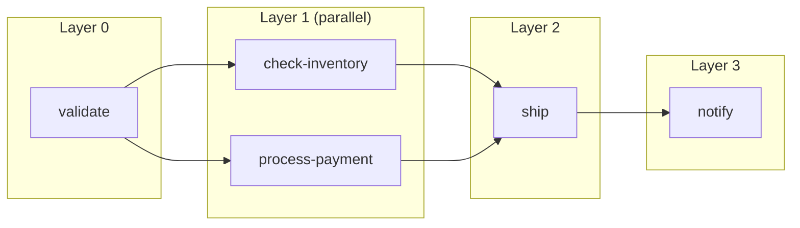

**Key Properties:**
- **Layer 0**: Contains root steps (no dependencies)
- **Subsequent Layers**: Steps whose dependencies are all in previous layers
- **Parallel Execution**: Steps within the same layer can execute concurrently
- **Deterministic Order**: Steps within a layer are sorted by `order` attribute

### Topology Validation

The topology is validated during workflow registration:

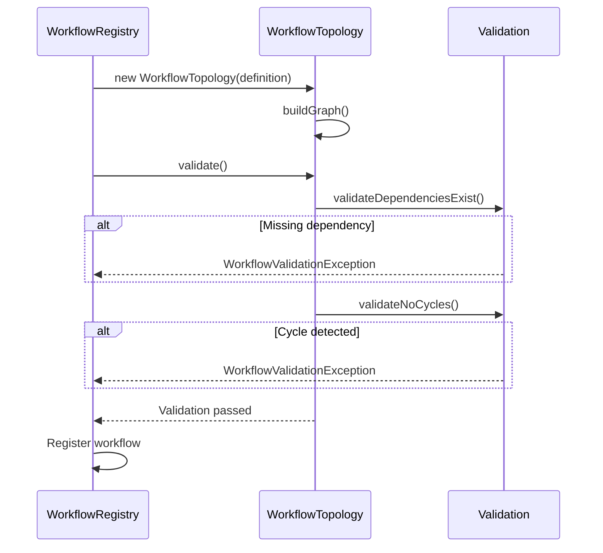

**Validation Checks:**
1. **Missing Dependencies**: All referenced step IDs must exist in the workflow
2. **Cycle Detection**: No circular dependencies allowed (uses DFS with recursion stack)

### Kahn's Algorithm Implementation

The algorithm builds execution layers as follows:

1. Calculate in-degree (number of dependencies) for each step
2. Add all steps with in-degree 0 to the first layer
3. For each step in the current layer:
   - Mark as processed
   - Decrement in-degree of dependent steps
4. Repeat until all steps are processed

```java
// Simplified algorithm
while (processed.size() < totalSteps) {
    List<Step> currentLayer = steps.stream()
        .filter(s -> inDegree.get(s) == 0 && !processed.contains(s))
        .collect(toList());

    layers.add(currentLayer);

    for (Step step : currentLayer) {
        processed.add(step);
        for (Step dependent : getDependents(step)) {
            inDegree.put(dependent, inDegree.get(dependent) - 1);
        }
    }
}
```

### Backward Compatibility

If no steps have explicit dependencies, the engine falls back to **order-based execution**:

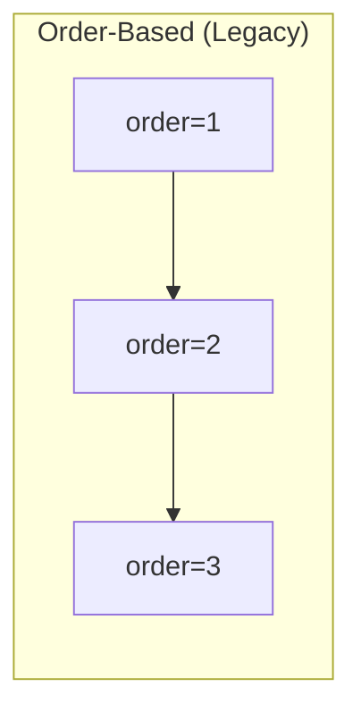

## Step-Level Choreography

The engine supports step-level choreography where steps can be triggered independently:

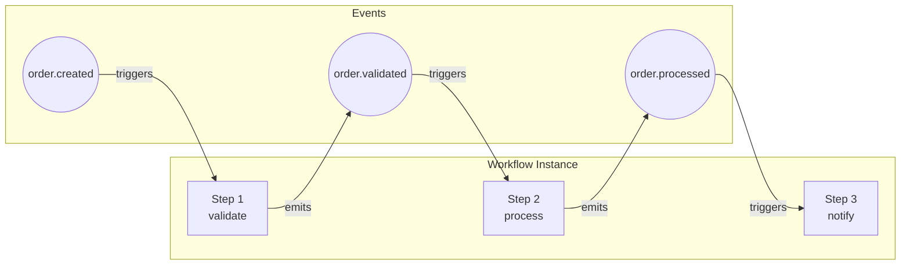

### Step State Persistence

Each step maintains its own state independent of the workflow:

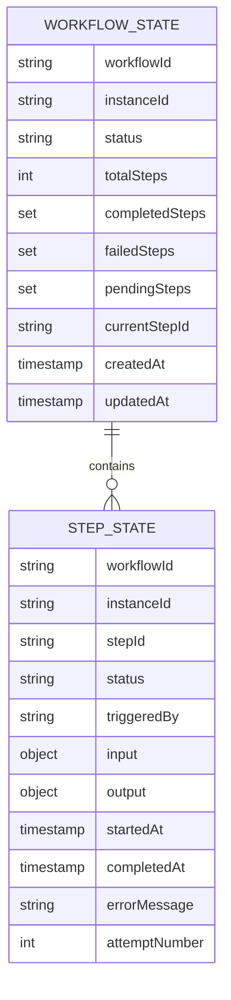

## Cache Key Structure

State is stored in the cache with the following key patterns:

| Key Pattern | Description |
|-------------|-------------|
| `workflow:{workflowId}:{instanceId}` | Workflow instance data |
| `workflow:state:{workflowId}:{instanceId}` | Enriched workflow state |
| `workflow:step:{workflowId}:{instanceId}:{stepId}` | Individual step state |

## Resilience4j Integration

The resilience layer wraps step execution with multiple patterns:

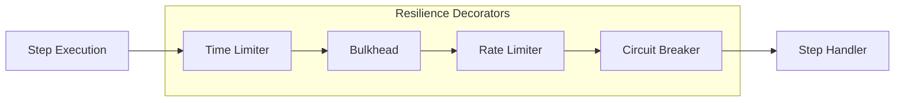

### Circuit Breaker States

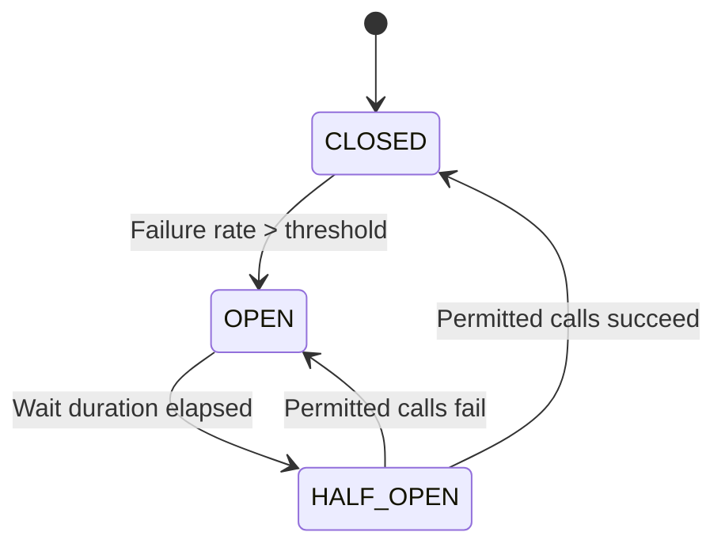

## Auto-Configuration

The library uses Spring Boot auto-configuration:

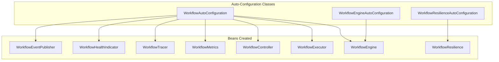

## Event Flow

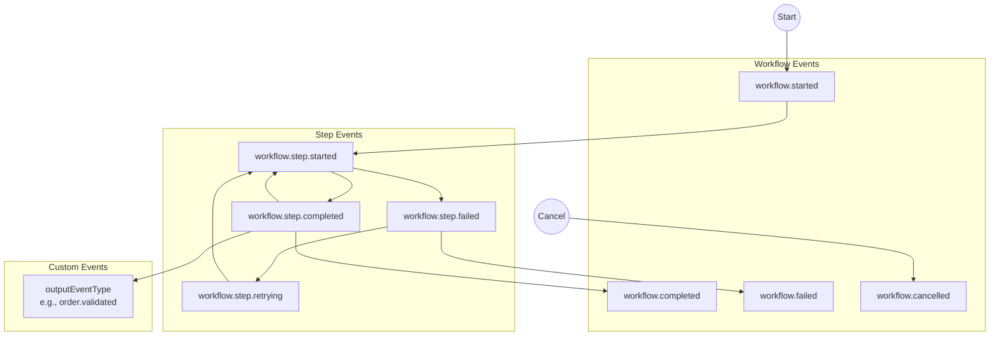

## Integration Points

### fireflyframework-cache

Used for state persistence:
- Workflow instance state
- Step execution state
- Workflow state aggregation

Supports:
- Redis (production)
- Caffeine (development/testing)

### fireflyframework-eda

Used for event publishing and listening:
- Workflow lifecycle events
- Step lifecycle events
- Custom step output events
- Workflow trigger events

Supports:
- Kafka
- RabbitMQ
- SNS/SQS
- Application Events (in-memory)

## Thread Model

The workflow engine uses Project Reactor for non-blocking execution:

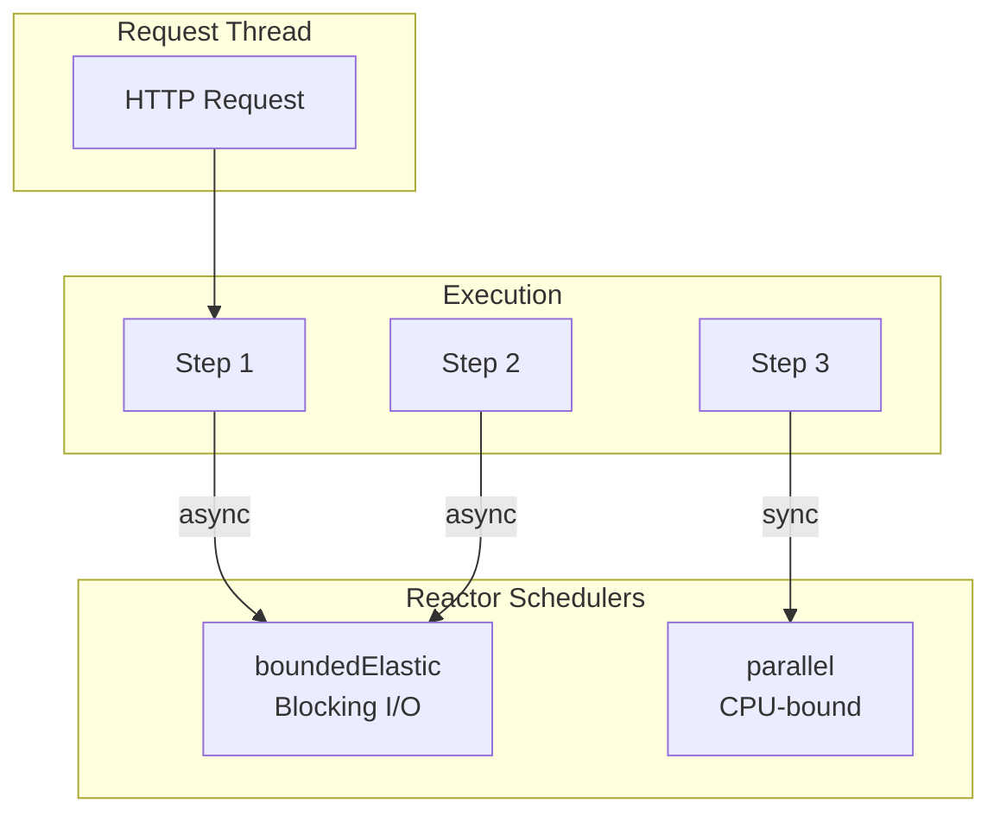

## Next Steps

- [Getting Started](getting-started.md) - Step-by-step tutorial
- [Advanced Features](advanced-features.md) - Resilience4j, choreography, and more
- [Configuration Reference](configuration.md) - All configuration options
- [API Reference](api-reference.md) - REST and Java API documentation