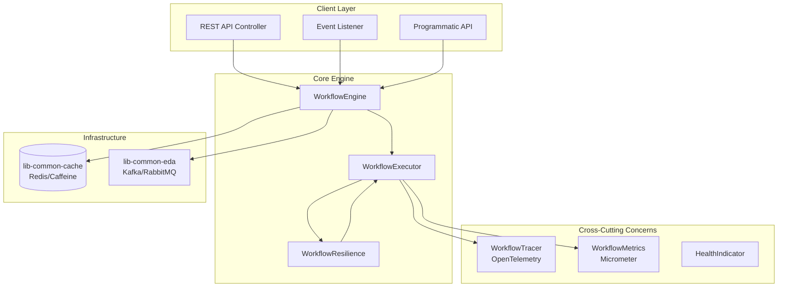
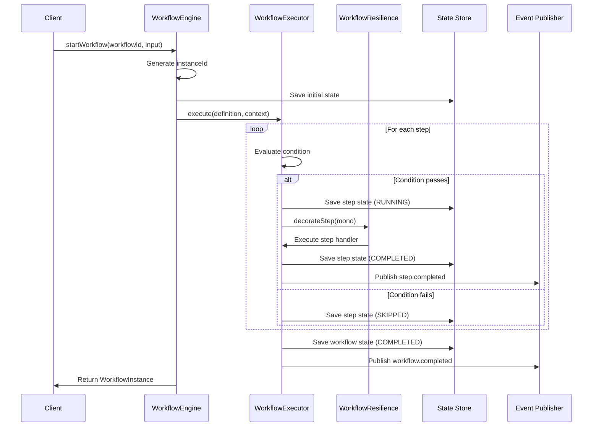
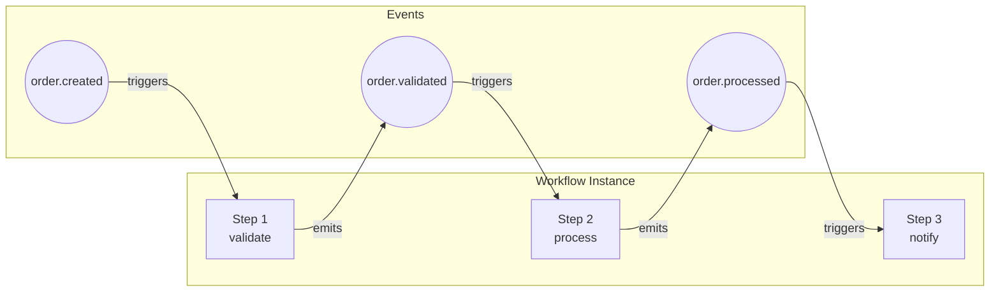
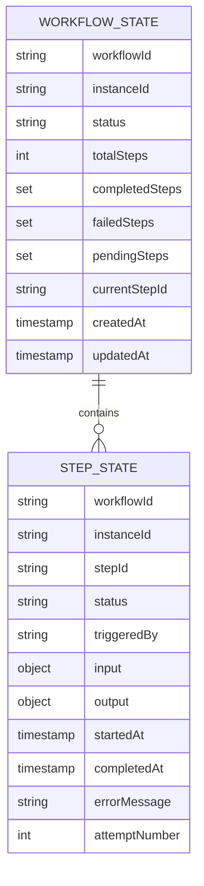
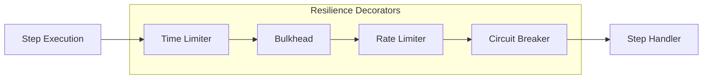
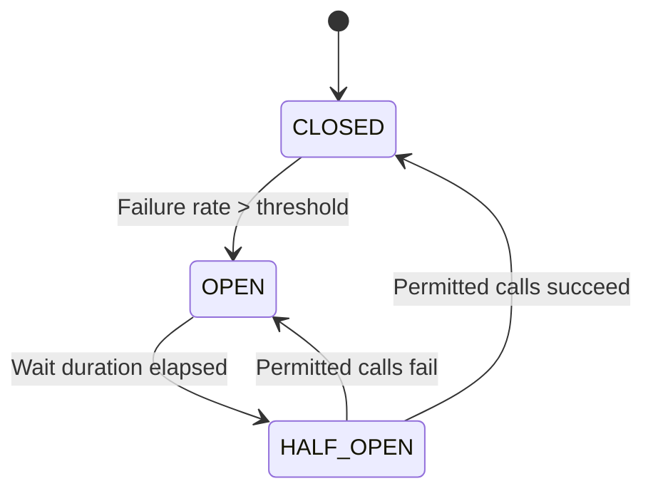
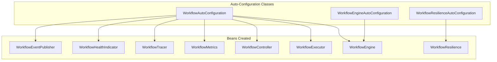
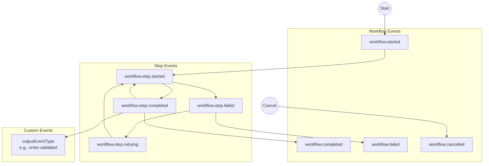
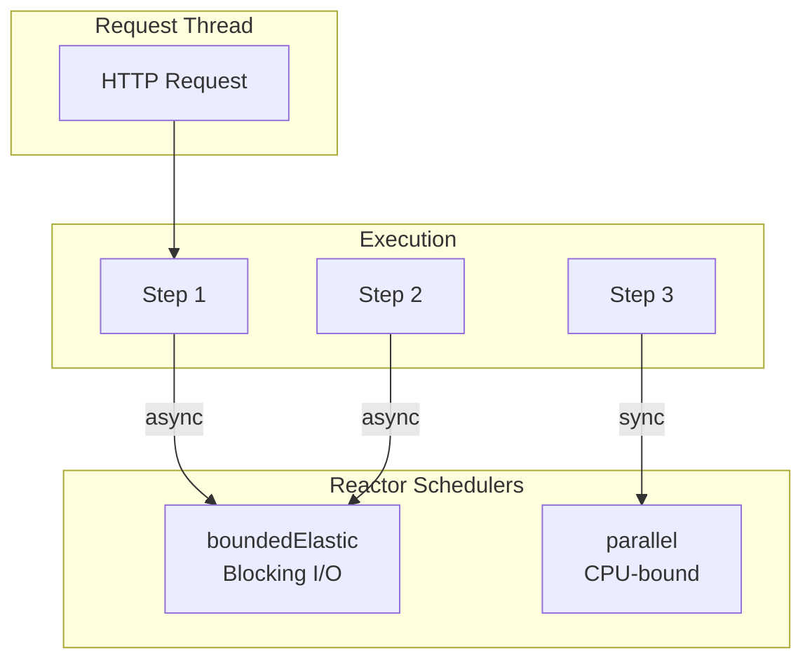

# Architecture Overview

This document describes the architecture of the Firefly Workflow Engine, including component diagrams, data flow, and integration points.

## High-Level Architecture

The workflow engine follows a layered architecture with clear separation of concerns:

## Component Descriptions

### WorkflowEngine

The main facade providing high-level API for workflow operations:

- `startWorkflow()` - Start a new workflow instance
- `getStatus()` - Get workflow instance status
- `triggerStep()` - Trigger a specific step (choreography)
- `cancelWorkflow()` - Cancel a running workflow
- `retryWorkflow()` - Retry a failed workflow
- `collectResult()` - Get the result of a completed workflow
- `getWorkflowState()` - Get enriched workflow state with step details

### WorkflowExecutor

Executes workflow steps with resilience patterns:

- Manages step execution order
- Handles parallel step execution
- Evaluates SpEL conditions
- Applies retry logic
- Persists step and workflow state
- Publishes step events

### WorkflowResilience

Decorates step execution with Resilience4j patterns:

- **Circuit Breaker**: Prevents cascading failures
- **Rate Limiter**: Controls execution rate
- **Bulkhead**: Limits concurrent executions
- **Time Limiter**: Enforces timeouts

## Workflow Execution Flow

## Step-Level Choreography

The engine supports step-level choreography where steps can be triggered independently:

### Step State Persistence

Each step maintains its own state independent of the workflow:

## Cache Key Structure

State is stored in the cache with the following key patterns:

| Key Pattern | Description |
|-------------|-------------|
| `workflow:{workflowId}:{instanceId}` | Workflow instance data |
| `workflow:state:{workflowId}:{instanceId}` | Enriched workflow state |
| `workflow:step:{workflowId}:{instanceId}:{stepId}` | Individual step state |

## Resilience4j Integration

The resilience layer wraps step execution with multiple patterns:

### Circuit Breaker States

## Auto-Configuration

The library uses Spring Boot auto-configuration:

## Event Flow

## Integration Points

### lib-common-cache

Used for state persistence:
- Workflow instance state
- Step execution state
- Workflow state aggregation

Supports:
- Redis (production)
- Caffeine (development/testing)

### lib-common-eda

Used for event publishing and listening:
- Workflow lifecycle events
- Step lifecycle events
- Custom step output events
- Workflow trigger events

Supports:
- Kafka
- RabbitMQ
- SNS/SQS
- Application Events (in-memory)

## Thread Model

The workflow engine uses Project Reactor for non-blocking execution:

## Next Steps

- [Getting Started](getting-started.md) - Step-by-step tutorial
- [Advanced Features](advanced-features.md) - Resilience4j, choreography, and more
- [Configuration Reference](configuration.md) - All configuration options
- [API Reference](api-reference.md) - REST and Java API documentation